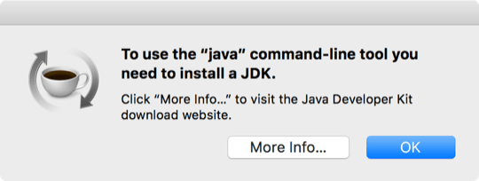

# Tests

This section provides the versions of the operating system, IDEs and plug-ins, as well as the list of the boards tested.

## Operating system and Xcode

| | Element | Version
---- | ---- | ----
 | macOS | 10.15.7
 | Xcode | 11.7

!!! danger
    embedXcode does not support macOS 11 *Big Sur* and Xcode 12.

For more information on macOS 11 and Xcode 12,

+ Please refer to [Assessing macOS 11 and Xcode 12](../../Appendixes/Section11/#assessing-macos-11-and-xcode-12) :octicons-link-16:.

## IDEs, boards and plug-ins versions

### Active platforms

The test protocol includes building and linking, uploading and running a sketch on the boards using those versions of the IDEs and plug-ins. Boards packages are versioned but not dated.

| | Platform | IDE | Package | Date | Comment
---- | ---- | ---- | ---- | ---- | ----
 | **Adafruit** | Arduino 1.8 | AVR 1.4.14 | |
| | | | nRF52 1.3.0 | | For Feather nRF52832 and nRF52840 boards
| | | | SAMD 1.7.11 | | For Feather M0 and M4 boards
 | **Arduino** | Arduino 1.8.13 | | 16 June 2020 | All versions prior to 1.8.0 are deprecated
| | | | AVR 1.8.6 | |
| | | | mbed-nano 3.0.1 | | For Nano 33 BLE boards
| | | | mbed-RP2040 3.0.1 | | For Raspberry Pi Pico RP2040 boards, not recommended
| | | | MegaAVR 1.8.7 | | For Nano Every board
| | | | nRF52 1.0.2 | | For Primo and Primo Core boards
| | | | SAM 1.6.12 | | For Due board
| | | | SAMD 1.8.13 | | For Nano 33 IoT, Zero, M0 and Tian boards
 | **ATtinyCore** | Arduino 1.8 | 1.3.3 | |
 | **Espressif** | Arduino 1.8 | ESP32 2.0.5 | | Valid for other ESP32 and ESP32C3-based boards
| | | | ESP8266 3.0.1 | | Valid for other ESP8266-based boards
 | **LaunchPad** | Energia 1.8.10E23 | | 17 Dec 2019 | Actually released 02 Feb 2020
| | | | CC13x0 EMT 4.9.1 | | For CC1310- and CC1350-based boards
| | | | CC13x2 EMT 5.31.0-beta3 | | For CC1312- and CC1352-based boards
| | | | CC3200 1.0.3 | |
| | | | CC3220 EMT 5.6.2 | | For CC3220S and CC3220SF LaunchPad boards
| | | | MSP430 1.0.7 | | For MSP430G2, MPS430F and MSP430FR LaunchPad boards
| | | | MSP430 ELF 2.1.0 | | For MPS430FR LaunchPad boards
| | | | MSP432E EMT 5.19.0 | | For MSP432E401Y and TM4C1294XL LaunchPad boards
| | | | MSP432P EMT 5.29.0-beta1 | | For red MSP432P4111 LaunchPad board
| | | | MSP432R EMT 5.29.0 | | For red MSP432P401R LaunchPad board
| | | | Tiva C 1.0.4 | | For LM4F- and TM4C-based LaunchPad boards
 | **MiniCore** | Arduino 1.8 | 2.0.1 | | Boot-loader for AVR ATmega boards
 | **nRF5 boards** | Arduino 1.8 | 0.7.0 | | Additional libraries are required
 | **Seeeduino** | Arduino 1.8 | AVR 1.3.0 | | For Seeeduino and Seeed Grove Beginner Kit
| | | | SAMD 1.8.0 | | For Xiao and Wio Terminal board
| | | | Realtek 3.0.7 | | For RTL8720DN on Wio Terminal board
 | **RasPiArduino** | Arduino 1.8 | 0.0.1 | | For Raspberry Pi boards, not recommended
 | **RP2040** | Arduino 1.8 | 2.6.4 | | For Raspberry Pi RP2040-based boards
 | **STM32** | Arduino 1.8 | 2.3.0 | | For Nucleo and Discovery boards
 | **Teensy** | Teensyduino 1.54 | | 04 Jul 2021 |

### Legacy platforms

Support for the following platforms is either put on hold or discontinued.

| | Platform | IDE | Package | Date | Comment
| ---- | ---- | ---- | ---- | ---- | ----
 | **Arduino** | Arduino 1.8 | STM32F4 1.0.1 | | For never released Star Otto board
 | **Arducam**| Arduino 1.6.5 | ESP8266 2.2.0 | | For ArduCAM ESP8266 board
 | **chipKIT** | Arduino 1.8 | 2.1.0 | | Including 4D Systems PICadillo board
 | **Cosa** | Arduino 1.8 | 1.2.0 | | For AVR boards
 | **Digistump** | Arduino 1.8 | AVR 1.6.7 | | For Digispark board
| | | | Oak 1.0.6 | | For Oak board
 | **ftDuino** | Arduino 1.8 | 0.0.13 | | Beta!
 | **Intel** | Arduino 1.8 | Galileo 1.6.7+1.0 | | No longer supported by Intel
| | | | Edison 1.6.7+1.0 | | No longer supported by Intel
| | | | Curie 2.0.4 | | No longer supported by Intel
 | **LaunchPad** | Energia 1.6.10E18 | C2000 | 09 Dec 2015 | Beta! Migrated from Energia 0101E0017
| | | | CC2650 | 09 Dec 2015 | Beta! Migrated from Energia 0101E0017
| | | | CC3200 EMT 1.0.0 | | No longer available
| | | | MSP432 EMT 3.8.0 | | For discontinued black MSP432 LaunchPad board
| | | Energia 0101E0012 | MSP430G2 | 18 Mar 2014 | Beta! Migrated from Energia 0101E0012
 | **LightBlue** | Arduino 1.8 | Bean Loader 1.12.6 | | For discontinued Bean and Bean+ boards
 | **Little Robot Friends** | Arduino 1.8 | Library 1.6.0 | | Library 1.0 is no longer supported
| | | | Little Robot Friends 2.2.0 | | Beta support for library 2.0
 | **MediaTek LinkIt** | Arduino 1.8 | One 1.1.23 | | For LinkIt One board
| | | | Duo 0.1.8 | | For Smart 7688 Duo board in Arduino mode
| | | | 7697 0.10.21 | | For LinkIt 7697 board
 | **Microsoft** | Arduino 1.8 | AZ3166 2.0.0 | | For AZ3166 IoT DevKit board
 | **Microduino** | Arduino 1.8.4 | Microduino 5.0 | 25 Mar 2019 | For AVR-based boards
| | | Maple IDE 0.0.12 | | | For STM32-based boards
 | **Moteino** | Arduino 1.8 | 1.6.1 | | Additional libraries are required
 | **panStamp** | Arduino 1.8 | AVR 1.5.7 | | panStamp AVR
| | | | NRG 1.1.0 | | panStamp NRG
| | | | STM32L4 0.0.28 | | panStamp Quantum boards
 | **Particle** | | Firmware 0.3.4 | 22 Oct 2014 | Development on hold
 | **RedBear** | Arduino 1.8 | AVR 1.0.3 | | For discontinued AVR boards
| | | | nRF51822 1.0.8 | | For discontinued nRF51822 and BLE nano boards
| | | | nRF52832 0.0.2 | | For discontinued nRF52832 boards
| | | | STM32F2 0.3.3 | | For discontinued RedBear Duo board
| | | | Energia 1.6.10E18 | | For discontinued CC3200-based boards
 | **RFduino** | Arduino 1.8 | 2.3.1 | | For discontinued RFduino board
 | **Robotis** | Robotis OpenCM 1.0.2 | | 23 May 2013 | Based on Maple IDE
 | **Simblee** | Arduino 1.8 | 1.1.4 | | For discontinued RFduino board
 | **STM32duino** | Arduino 1.8 | 1.8 | | For Nucleo and Discovery boards
 | **Arduino STM32** | Arduino 1.8 | 2019.12.31 | | For STM32F1 and STM32F4 boards
 | **TinyCircuits** | Arduino 1.8 | 1.0.8 | |
 | **Udoo Neo** | Arduino 1.8 | 1.6.7 | | For Arduino 1.6.5 IDE only
 | **Wiring** | Wiring 1.0.1 | | 28 Oct 2014 | Discontinued
 | **Edison Yocto** | | SDK 3.0 | Mar, 15, 2016 | No longer supported by Intel
 | **Edison MCU** | | MCU SDK 1.0.10 | 24 Apr 2015 | No longer supported by Intel

## What has been tested

The test protocol includes build and link, upload and run of a functioning sketch on the boards. Obviously, the tests are performed only on the boards and programmers owned.

### Active platforms

Support for the following platforms is active.

| | <b>Platform</b> | <b>Officially tested</b> | <b>Tested by users</b> | <b>Not tested</b>
---- | ---- | ---- | ---- | ----
 | **Adafruit** | Adafruit Atmega32u4 Breakout Board (with Adafruit USBtinyISP), Adafruit Trinket 5V 16MHz, Adafruit Pro Trinket 5V 16MHz, Adafruit Feather M0 Bluefruit LE, Adafruit Feather M0 (with USB or Segger J-Link), Adafruit Feather M4 (with MSD, USB or Segger J-Link), Adafruit Feather nRF52832 (with USB or Segger J-Link), Adafruit Feather nRF52832 (with MSD, USB or Segger J-Link) | Adafruit Trinket 3V 8MHz, Pro Trinket 3V 12MHz, Adafruit Feather 32u4, Adafruit Huzzah ESP8266, Adafruit PyPortal M4 (with MSD or USB) |
 | **Arduino** | Arduino Uno, Arduino Due, Arduino Duemilanove, Mega2560, Mini Pro 5V, Arduino Leonardo, Arduino Uno with MiniCore boot-loader, Arduino Uno (with Adafruit USBtinyISP), Arduino Due (with USB or Segger J-Link), Arduino Y&uacute;n (with USB, WiFi or Ethernet), Arduino Tian (with USB, WiFi or Ethernet), Arduino M0 Pro, Arduino Zero, Arduino Primo, Arduino Nano Every, Arduino Nano 33 BLE, Arduino Nano 33 IoT | Arduino Micro, Mini Pro 3.3V, Arduino Due (with Atmel ICE) | Arduino Mini, Arduino Nano, Arduino MKR FOX 1200, Arduino MKR GSM 1400, Arduino MKR NB 1500, Arduino MKR WAN 1300, Arduino MKR WiFi 1000, Arduino MKR WiFi 1010, Arduino MKR Zero, Arduino Portenta H7 (M4 core), Arduino Portenta H7 (M7 core)
 | **ATtinyCore** | | | ATtiny84
 | **BBC micro:bit** | BBC micro:bit v1, BBC micro:bit v2 | |
 | **ESP32** | ESP32-DevC, Adafruit Huzzah ESP32 (with USB or ESP-Prog), ESP32-CAM Wrover, ESP32-Pico (with USB or ESP-Prog) | Adafruit Huzzah ESP32 (with WiFi), Wemos LoLin D32, ESP32 DevKitC (Minimal SPIFFS), ESP32-DevC (with WiFi) |
 | **ESP8266** | ESP8266-01, NodeMCU board 0.9 and 1.0 | Wemos D1 R2 |
 | **LaunchPad** | LaunchPad MSP430G2 with MSP430G2553, LaunchPad MSP430G2-ET with MSP430G2553, LaunchPad MSP430F5529, LaunchPad MSP430FR2433, LaunchPad MSP430FR4133, LaunchPad MSP430FR5969, LaunchPad MSP430FR5994, LaunchPad MSP430FR6989, Experimenter Board MSP430FR5739, LaunchPad MSP432P401R, LaunchPad MSP432E401Y, LaunchPad LM4F120, LaunchPad TM4C123, LaunchPad TM4C129 Ethernet, LaunchPad TM4C129 EMT, LaunchPad CC1310, LaunchPad CC1350, LaunchPad CC3200 | LaunchPad MSP430FR2311, SensorTag CC1350, LaunchPad CC2650, LaunchPad CC3200, LaunchPad C2000 LaunchPad F28027, LaunchPad F28069, LaunchPad F28377S, LaunchPad MSP432E4111 | LaunchPad MSP430G2 with MSP430G2231, LaunchPad MSP430G2 with MSP430G2452
 | **Microsoft** | Azure IoT DevKit | |
 | **Moteino** | Moteino | |
 | **NodeMCU** | NodeMCU board 0.9 and 1.0 (with USB and WiFi) | |
 | **RasPiArduino** | Raspberry Pi 3B | |
 | **RP2040** | Raspberry Pi Pico | |
 | **Seeeduino** | Seeeduino v4, Xiao M0 (with MSD, USB or Segger J-Link), Wio Terminal (with MSD or USB) | |
 | **STM32duino** | Nucleo STM32F401RE | |
 | **Arduino STM32** | Maple 3 (Flash), Microduino Core STM32 (Flash) | | Nucleo F103RB (ST-Link)
 | **Teensy** | Teensy 3.0, Teensy 3.1, Teensy LC, Teensy 3.5, Teensy 3.6, Teensy 4.0 | Teensy 3.2, Teensy 4.1 | Teensy 2.0

Users have reported successful use of embedXcode on other boards. If you're successful with another board, please report it to me so I can update the list. Thank you!

### Legacy platforms

Support for the following platforms is either put on hold or discontinued.

| | <b>Platform</b> | <b>Officially tested</b> | <b>Tested by users</b> | <b>Not tested</b>
---- | ---- | ---- | ---- | ----
 | **Arduino** | | | Arduino Otto Star (with USB or Segger J-Link)
 | **ArduCAM** | ArduCAM ESP8266 and ArduCAM CC3200 | |
 | **Cosa** | Arduino Uno | |
 |**chipKIT** | chipKIT Uno32, chipKIT uC32, chipKIT DP32, chipKIT WF32, chipKIT WiFire Rev.B, chipKIT Uno32 (with chipKIT PGM) | chipKIT Max32, chipKIT WiFire Rev.C |
 | **DFRobot** | BLuno and Wido | |
 | **Digistump** | Digispark | Oak | DigiX
 | **ftDuino** | | ftDuino
 | **Glowdeck** | Glowdeck (with BLE) | Glowdeck (with USB or Segger J-Link) |
 | **Intel** | Intel Curie, Intel Galileo, Intel Galileo Gen2 on Wiring / Arduino, Intel Edison on Wiring / Arduino (with USB and WiFi), Intel Edison on Yocto and MCU (with USB and WiFi) | |
 | **LaunchPad** | Black LaunchPad MSP432P401 | |
 | **LightBlue** | LightBlue Bean Bluetooth | |
 | **Little Robot Friends** | Little Robot Friends AVR, Little Robot Friends Dock | | Little Robot Friends SAMD
 | **Maple** | Maple revision 5 | |
 | **Mediatek LinkIt** | MediaTek LinkIt One, MediaTek LinkIt Smart 7688 Duo on Wiring / Arduino, Mediatek LinkIT 7697 | |
 | **Microduino** | Microduino Core and Core+ (with FT232R), Microduino Core32u4, Microduino STM32 | |
 | **nRF5 boards** | RedBear Blend nRF51822, RedBear Blend nRF51822 | |
 | **panStamp** | panStamp AVR (with panStick), panStamp NRG 1.1 (with panStick) | | panStamp Quantum
 | **Particle** | Particle Core USB and WiFi | | Particle Photon
 | **Protostack** | Protostack 28-pin AVR board (with Adafruit USB tinyISP or Protostack USB ASP) | |
 | **RedBear** | RedBear nRF51822, RedBear Duo and Blend nRF52832 on Wiring / Arduino, RedBear CC3200, RedBear CC3200 Mini on Energia and Energia MT | RedBear BLE Nano on Wiring / Arduino, RedBear CC3200 Micro on Energia and Energia MT, RedBear Nano nRF52832 on Wiring / Arduino | RedBear Blend
 | **RFduino** | RFduino | |
 | **Robotis** | Robotis OpenCM 9.04 | |
 | **Simblee** | | Simblee |
 | **Sparkfun** | Sparkfun Uno (with Sparkfun 5V FTDI basic programmer) | |
 | **Udoo Neo** | Udoo Neo (M4) (with USB and WiFi) | |
 | **Wiring** | Wiring S | |

## Update to Energia 1.6.10E18 and 1.8.7E21

 Release 1.6.10E18 of Energia changes the boards tags and discontinues support for the CC2650 SensorTag and C2000 LaunchPad boards.

Release 1.8.7E21 of Energia isn't self-contained and requires the installation of the Java 8 JDK for external utilities.

For the conversion table and the update procedure,

+ Please refer to section [Energia old and new boards tags](../../Appendixes/Section6/#energia-old-and-new-boards-tags) :octicons-link-16:.

For the installation and use of Energia release 0101E0017 for CC2650 SensorTag and C2000 LaunchPad boards,

+ Please refer to section [Install the C2000 LaunchPad Platform](../../Install/Section4/#install-the-launchpad-c2000-boards) :octicons-link-16:.

To install Java 8,

+ Please refer to section [Install Java 8](../../Appendixes/Section6/#install-java-8) :octicons-link-16:.

### Energia old and new boards tags

Release 1.6.10E18 of Energia changes the boards tags.

LaunchPad | Old | New
---- | ---- | ----
CC3200 WiFi | `lpcc3200` | `CC3200-LAUNCHXL`
LM4F120 Stellaris | `lplm4f120h5qr` | `EK-TM4C123GXL`
MSP430F5529 | `lpmsp430f5529_25` | `MSP-EXP430F5529LP`
MSP430FR4133 | `lpmsp430fr4133` | `MSP-EXP430FR4133LP`
MSP430FR5739 | `lpmsp430fr5739` | `MSP-EXP430FR5739LP`
MSP430FR5969 | `lpmsp430fr5969` | `MSP-EXP430FR5969LP`
MSP430FR6989 | `lpmsp430fr6989` | `MSP-EXP430FR6989LP`
MSP430G2553 | `lpmsp430g2553` | `MSP-EXP430G2553LP`
MSP432P401 EMT Red | `MSP-EXP432P401RR` | `MSP-EXP432P401R`
TM4C123 Tiva C | `lptm4c1230c3pm` | `EK-TM4C123GXL`
TM4C129 Connected | `lptm4c1294ncpdt` | `EK-TM4C1294XL`

### Install Java 8

The Energia 1.8 IDE isn't self-contained and requires the installation of the Java 8 JDK for external utilities. If the Java 8 JDK isn't available, Energia prompts an error message.

If you don't plan to use the Energia IDE, there is no need for installing the Java 8 JDK as embedXcode doesn't require it.

+ Go to [Java SE Development Kit 8 Downloads](https://www.oracle.com/technetwork/java/javase/downloads/jdk8-downloads-2133151.html) :octicons-link-external-16: on the Oracle website.

+ Download and install the `jdk-8u111-macosx-x64` package.

+ Relaunch Energia 1.8 IDE.

## Adafruit nRF52 old and new boards tags

 Release 0.9.0 of the Adafruit nRF52 boards package changes the tags and the names of the boards. The Feather nRF52 board is now called Feather nRF52832.

Feather | Old | New
---- | ---- | ----
nRF52832 | `feather52` | `feather52832`
| Feather nRF52 | Feather nRF52832

If a project uses the old definition,

+ Create a new project with the Adafruit nRF52 board.

+ Copy the `Configurations` folder of the new project to the `Configurations` folder of the initial project.

+ Reselect the board on the initial project.

The two options for the boot-loader, `s132v201` and `s132v6` are replaced by a single one, `s132v6`.

The boards Adafruit Feather nRF52 and Adafruit Feather nRF52 s132v510 are no longer supported.

+ Use the boards Adafruit Feather nRF52832 s132v611 instead.

If the Feather nRF52832 board has been used with a previous version of Adafruit nRF52 boards package, the boot-loader of the board needs to be updated when moving to release 0.9.0.

+ Please follow the procedure [Flashing the Bootloader](https://learn.adafruit.com/bluefruit-nrf52-feather-learning-guide/flashing-the-bootloader) :octicons-link-external-16: at the Adafruit website.

## BBC micro-bit old and new boards names

 With the introduction of the new BBC micro-bit v2 based on the nRF52833 MCU, the name of the board configuration file ot the previous version based on the nRF51822 MCU is now `nRF BBC micro-bit v1 nRF51`.

BBC micro-bit | Old | New
---- | ---- | ----
v1 | `nRF BBC micro-bit nRF51` | `nRF BBC micro-bit v1 nRF51`
v2 | | `BBC micro-bit v2 nRF52`
