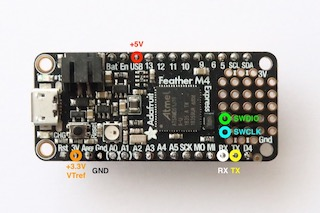
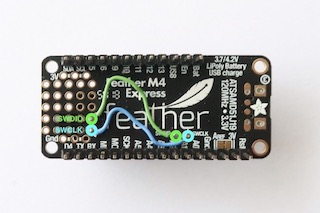

---
tags:
    - Active
---

# Manage the Adafruit Feather M0 and M4 boards

## Install

To install the Adafruit Feather M0 and M4 boards,

+ Ensure the Arduino tools, CLI or IDE, are installed.

+ Ensure the `arduino-cli.yaml` configuration file for Arduino-CLI or the **Additional boards manager URLs** for Arduino IDE includes

```
https://adafruit.github.io/arduino-board-index/package_adafruit_index.json
```

+ Open a **Terminal** window.

+ Run

``` bash dollar
arduino-cli core install adafruit:samd
```

For more information on the Feather M0,

+ Please refer to the section [Arduino IDE Setup](https://learn.adafruit.com/adafruit-feather-m0-express-designed-for-circuit-python-circuitpython/arduino-ide-setup) :octicons-link-external-16:.

For more information on the Feather M4,

+ Please refer to the section [Arduino IDE Setup](https://learn.adafruit.com/adafruit-feather-m4-express-atsamd51/setup) :octicons-link-external-16:.

For debugging against the Feather M0 and M4, use the Segger J-Link emulator.

For more information,

+ Please refer to the section [Install utilities for Segger debugger](../../Install/Section4/#install-utilities-for-segger-debugger) and to the page [Proper Debugging of ATSAMD21 Processors](https://learn.adafruit.com/proper-step-debugging-atsamd21-arduino-zero-m0) :octicons-link-external-16: on the Adafruit website.

## Develop

### Use the libraries for WiFi

### Use the libraries for Bluetooth

### Use the libraries for SD

## Upload

 For the Adafruit Feather M0 and M4 boards, Adafruit offers two options to upload the executable to the boards.

The first option is the standard upload procedure through serial over USB.

The second option, called UF2 for USB Flashing Format, turns the board into a mass storage device. Programming is done with a simple drag-and-drop or copy of the executable onto the mass storage device.

### Upload using standard USB

Before uploading using the standard USB procedure,

+ Plug the Adafruit board in.

+ Check the LED on the board is green.

+ Otherwise, double-press the ++reset++ button on the board to enter boot-loader mode.

For more information,

+ Please refer to the page [Manually bootloading](https://learn.adafruit.com/adafruit-feather-m4-express-atsamd51/using-with-arduino-ide#manually-bootloading-6-32) :octicons-link-external-16:.

### Upload using UF2

For the Adafruit Feather M0 and M4 boards, this drag-and-drop procedure requires a specific format. The executable needs to be converted into a `.uf2` file. The utility for the conversion is provided by the Adafruit nRF52 boards package.

To install the Adafruit nRF52 boards package,

+ Please refer to [Install the Adafruit platform](../../Install/Section4/Adafruit) section.

Before uploading,

+ Plug the Adafruit board in.

+ Check a volume called `FEATHERBOOT` is shown on the desktop.

+ Otherwise, double-press the ++reset++ button on the board to activate it.

+ Check the LED on the board is green.

For more information on the Feather M0 and the UF2 boot-loader,

+ Please refer to the pages [UF2 Bootloader Details](https://learn.adafruit.com/adafruit-feather-m0-express-designed-for-circuit-python-circuitpython/uf2-bootloader-details) :octicons-link-external-16:, [Installing the UF2 Bootloader](https://learn.adafruit.com/installing-circuitpython-on-samd21-boards/installing-the-uf2-bootloader) :octicons-link-external-16:, [UF2 Bootloader Details](https://learn.adafruit.com/adafruit-feather-m4-express-atsamd51/uf2-bootloader-details) :octicons-link-external-16: and [Updating the boot-loader](https://learn.adafruit.com/adafruit-feather-m0-express-designed-for-circuit-python-circuitpython/uf2-bootloader-details#updating-the-bootloader-46-33) :octicons-link-external-16:.

For more information on the Feather M4 and the UF2 boot-loader,

+ Please refer to the pages [UF2 Bootloader Details](https://learn.adafruit.com/adafruit-feather-m4-express-atsamd51/uf2-bootloader-details) :octicons-link-external-16:, [Entering Bootloader Mode](https://learn.adafruit.com/adafruit-feather-m4-express-atsamd51/uf2-bootloader-details) :octicons-link-external-16: and [Manually bootloading](https://learn.adafruit.com/adafruit-feather-m4-express-atsamd51/using-with-arduino-ide#manually-bootloading-6-32) :octicons-link-external-16:.

## Debug

 The Adafruit Feather M0 exposes the SWD signals through SWCLK and SWDIO pads and the Adafruit Feather M4 through a 2x5 0.05" connector.

Cables and pins should be soldered to connect the Segger J-Link programmer-debugger.

<center> </center>
<center>*Example of SWD implementation for the Feather M4 board, front and rear*</center>

For more information on how to prepare the boards,

+ Please refer to [Segger J-Link with Adafruit Feather M4](https://embeddedcomputing.weebly.com/segger-j-link-with-adafruit-feather-m4.html) :octicons-link-external-16:.
