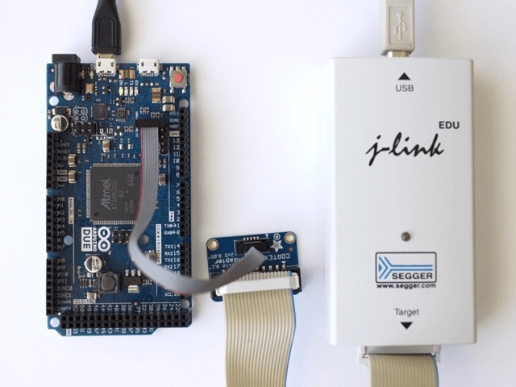

---
tags:
    - Active
---

# Manage the Arduino SAM boards

The Arduino SAM platform includes the Arduino Due.

## Install

To install the Arduino SAM boards,

+ Ensure **Arduino-CLI** is installed.

+ Open a **Terminal** window.

+ Run

``` bash dollar
arduino-cli core install arduino:sam
```

## Develop

## Upload

## Debug

 The Segger J-Link provides a JTAG 2x10 2.54 mm 0.1" connector while the Arduino Due features a 2x5 1.27 mm 0.05" SWD connector.

+ Use for example the [JTAG (2x10 2.54mm) to SWD (2x5 1.27mm) Cable Adapter Board](https://www.adafruit.com/products/2094) :octicons-link-external-16: and a [10-pin 2x5 Socket-Socket 1.27mm IDC (SWD) Cable - 150mm long](https://www.adafruit.com/products/1675) :octicons-link-external-16: from Adafruit, or similar hardware.

If the software suite for the Segger J-Link isn't installed,

+ Follow the procedure at [Install the Segger J-Link Software Suite](../../Install/Section4/#install-the-segger-j-link-software-suite).

+ Double-check the orientation of the SWD connector on the Arduino Due schematics.

<center></center>
<center><i>Arduino Due, SWD to JTAG adaptor, Segger J-Link</i></center>
