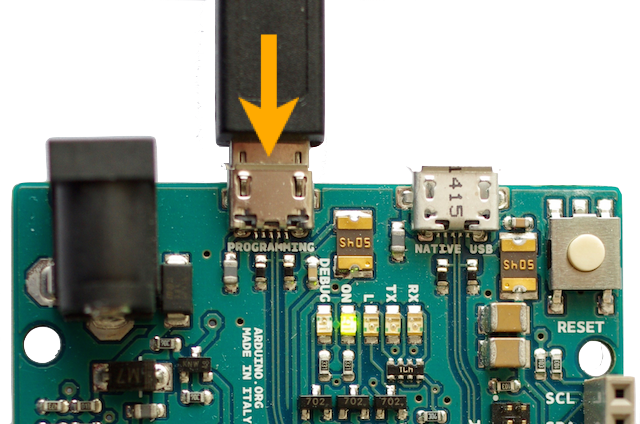
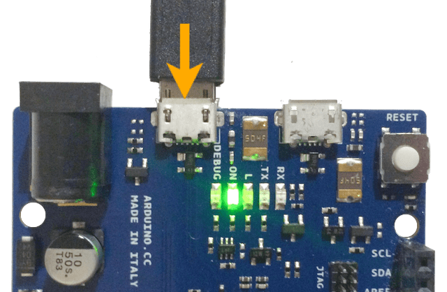
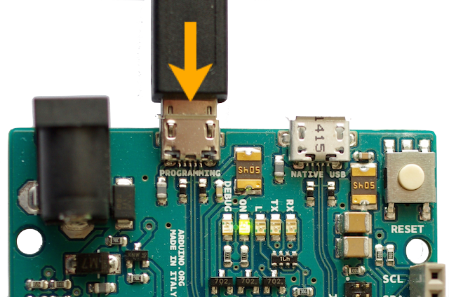

---
tags:
    - Active
---

# Manage the Arduino SAMD boards

The arduino SAMD platform includes the Arduino Nano 33 IoT, Arduino Zero, Arduino M0 and Arduino Tian boards.

## Install

To install the Arduino SAMD boards,

+ Ensure **Arduino-CLI** is installed.

+ Open a **Terminal** window.

+ Run

``` bash dollar
arduino-cli core install arduino:samd
```

## Develop

## Upload to Arduino M0 Pro

 The Arduino M0 Pro has two USB connectors: one called native and another called programmer. Both can be used to upload a sketch.

However, the programming port offers a better stability and is required for debugging.

<center></center>
<center>*Programming port left, native USB port right*</center>

+ Click on **Allow** to proceed.

## Upload to Arduino Zero

 The Arduino Zero has two USB connectors: one called native and another called programmer. Both can be used to upload a sketch.

However, the programming port offers a better stability and is required for debugging.

<center></center>
<center>Programming port left, native USB port right</center>

## Debug

### Select the USB Port for the Arduino M0 Pro

+ Connect the USB cable to the Programmer USB Port is order to perform debugging. The native USB port doesn't feature debugging.

<center></center>

+ Use the USB Programming port

### Declare the Arduino Zero CMSIS-DAP device

On Linux, the Arduino Zero CMSIS-DAP device may need to be declared.

+ Open a **Terminal** window and run

``` bash dollar
sudo nano /etc/udev/rules.d/98-openocd.rules
```

+ Edit

``` bash
ACTION!="add|change", GOTO="openocd_rules_end"
SUBSYSTEM!="usb|tty|hidraw", GOTO="openocd_rules_end"
ATTRS{product}=="*CMSIS-DAP*", MODE="664", GROUP="plugdev"
LABEL="openocd_rules_end"
```

+ Save and close with ++ctl+o++ ++ctrl+x++;

+ Update with

``` bash dollar
sudo udevadm control --reload
```

For more information on CMSIS-DAP,

+ Please refer to [Arduino Zero error: unable to find CMSIS-DAP device](https://arduino.stackexchange.com/questions/28566/arduino-zero-error-unable-to-find-cmsis-dap-device)
