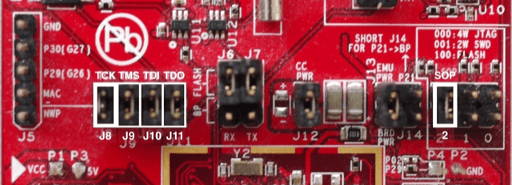

# Manage the LaunchPad CC3200 boards

The LaunchPad CC3200 platform includes three variants: LaunchPad CC3200, LaunchPad CC3200-S and LaunchPad CC3200-SF.

## Install

## Develop

## Upload

## Debug

 The LaunchPad CC3200 WiFi requires a specific hardware configuration.

+ Unplug the LaunchPad CC3200 WiFi board.

+ Remove the wire from `JTAG J8` (emulator side) to `SOP 2` (CC3200) side.

+ Place the `TCK J8` jumper.

+ Place the `SOP 2` jumper.

<i>Debugging requires `TCK` and `SOP 2` jumpers placed on</i>

+ Plug the LaunchPad CC3200 WiFi board.

The project is uploaded into SRAM and is lost in case the power is disconnected. For more information,

+ Please refer to Upload to LaunchPad CC3200 WiFi.
