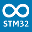

# Manage the STM32 boards

 The STM32 platform includes the Nucleo and Discovery boards based on the STM32 MCUs.

[STM32duino](./STM32.md) supports a wide range of STM32-based boards.

## Check the tests

The test protocol includes building and linking, uploading and running a sketch on the boards using those versions of the IDEs and plug-ins. Boards packages are versioned but not dated.

| | Platform | Package | Comment
---- | ---- | ---- | ----
 | **STM32** | 2.6.0 | For Nucleo and Discovery boards
 | **emCode** | 14.1.5 | 19 Jul 2023 |

## Visit the official websites

 | **STM32duino**
:---- | ----
IDE | Arduino CLI or IDE
Former | <http://www.stm32duino.com> :octicons-link-external-16:
Download | <https://github.com/stm32duino/Arduino_Core_STM32> :octicons-link-external-16:
Forum | <http://www.stm32duino.com> :octicons-link-external-16:

