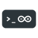

# Install the Arduino tools

 Arduino offers two options to manage the boards and libraries.

+ The **Arduino-CLI** provides a command-line interface for Arduino.

+ The **Arduino IDE** brings a GUI.

!!! note
    If emCode is used on Windows Sub-system for Linux, install the Arduino tools on the Linux environment.

## Use the Arduino-CLI

### Install the Arduino-CLI

 To install the Arduino-CLI under `~/.local/bin`,

+ Open a **Terminal** window;

+ Run

``` bash
$
cd ~/.local
curl -fsSL https://raw.githubusercontent.com/arduino/arduino-cli/master/install.sh | sh
```

+ Ensure that `~/.local/bin` is listed in `$PATH`.

``` bash
$
echo $PATH
```

Otherwise,

+ Edit  `~/.bashrc`

```
$
nano ~/.bashrc
```

+ Add `~/.local/bin` to `$PATH`

```
export PATH=$PATH:~/.local/bin
```

+ Save and close with ++ctrl+o++ and ++ctrl+x++.

For more information,

+ Please refer to the [Installation](https://arduino.github.io/arduino-cli/latest/installation) :octicons-link-external-16: and [Getting started](https://arduino.github.io/arduino-cli/latest/getting-started/) :octicons-link-external-16: pages.

### Configure Arduino-CLI

To configure Arduino-CLI,

+ Open a **Terminal** window;

+ Run

``` bash
$
arduino-cli config init
Config file written to: ~/.arduino15/arduino-cli.yaml
```

+ Edit it with

``` bash
$
nano ~/.arduino15/arduino-cli.yaml
```

+ Set the sketchbook folder;

``` yaml
  user: ~/Projects/Arduino
```

+ Save and close with ++ctrl+o++ and ++ctrl+x++.

For more information,

+ Please refer to the [Configuration](https://arduino.github.io/arduino-cli/latest/configuration/) :octicons-link-external-16: page of Arduino-CLI.

### Install additional boards

+ Open a **Terminal** window;

+ Run

``` bash
$
arduino-cli core install arduino:avr
```

The parameter `arduino:avr` refers to the name of the boards.

### Add URLs for new boards

+ Open the configuration file `arduino-cli.yaml`;

``` bash
$
nano ~/.arduino15/arduino-cli.yaml
```

+ Add the other boards;

``` yaml
board_manager:
  additional_urls:
  - https://adafruit.github.io/arduino-board-index/package_adafruit_index.json
  - http://downloads.arduino.cc/packages/package_mbed_index.json
  - https://raw.githubusercontent.com/espressif/arduino-esp32/gh-pages/package_esp32_index.json
  - https://github.com/earlephilhower/arduino-pico/releases/download/global/package_rp2040_index.json
  - https://files.seeedstudio.com/arduino/package_seeeduino_boards_index.json
  - https://github.com/stm32duino/BoardManagerFiles/raw/main/package_stmicroelectronics_index.json
  - https://www.pjrc.com/teensy/package_teensy_index.json
  - https://github.com/ambiot/ambd_arduino/raw/master/Arduino_package/package_realtek.com_amebad_index.json
```

+ Save and close with ++ctrl+o++ and ++ctrl+x++.

### Install additional libraries

+ Open a **Terminal** window;

+ Run

``` bash
$
arduino-cli lib install ArduinoBLE
```

### Check and update the boards

+ Open a **Terminal** window;

+ Check the cores

``` bash
$
arduino-cli core update-index
arduino-cli core upgrade
```

### Check and update the libraries

+ Open a **Terminal** window;

+ Check the libraries.

``` bash
$
arduino-cli lib update-index
arduino-cli lib upgrade
```

## Use the Arduino IDE

### Install the Arduino IDE

 To install the Arduino IDE,

+ Download and install Arduino 2.0 or later from [Arduino](https://www.arduino.cc/en/software/) :octicons-link-external-16: under the `~/Applications` folder.

+ Launch it.

!!! warning
    All releases of Arduino prior to release 2.0, including 0023, 1.0 and 1.5, and series 1.6, 1.7 and 1.8, are deprecated and not longer supported.

+ Define the path of the sketchbook folder in the menu **Arduino > Preferences > Sketchbook location**.

+ Avoid spaces in the name and path of the sketchbook folder.

In this example, the sketchbook folder is `~/Projects/Arduino`.

The Arduino 2.0 IDE provides two procedures to manage additional boards and libraries.

For more information,

+ Please refer to the [Getting Started with Arduino IDE 2](https://docs.arduino.cc/software/ide-v2/tutorials/getting-started-ide-v2) :octicons-link-external-16: page of the Arduino IDE.

### Configure the Arduino IDE

To configure the Arduino IDE,

+ Call the menu **File > Preferences...** or press ++ctrl+comma++ to open the **Preferences** window;

+ Confirm the **Sketchbook location**, for example `~/Projects/Arduino`;

+ Click on **OK** to close the window.

### Install additional boards

The Arduino IDE includes a **Boards Manager** for downloading and installing additional boards. It relies on a list of URLs set in the **Preferences** pane.

Either

+ Select the board icon on the left pane.

or

+ Call the menu **Tools > Board > Boards Manager...**

A new pane lists all the boards available, already installed or ready for installation, based on a set of URLs.

+ Select the board and click on **Install**.

If the board isn't listed, the URL needs to be added manually.

For more information on the installation of the additional boards on the Arduino IDE,

+ Please refer to the [Installing additional Arduino Cores](https://www.arduino.cc/en/Guide/Cores) :octicons-link-external-16: page on the Arduino website.

For more information on the installation of the additional boards on the Arduino IDE,

+ Please refer to the [Boards Manager](https://docs.arduino.cc/software/ide-v2/tutorials/getting-started-ide-v2#boards-manager) :octicons-link-external-16: page on the Arduino website.

### Add URLs for new boards

The **Boards Manager** lists the boards based on a set of URLs. To add a new board, the relevant URL should be added. The URL corresponds to a JSON file.

```
https://adafruit.github.io/arduino-board-index/package_adafruit_index.json
http://downloads.arduino.cc/packages/package_mbed_index.json
https://raw.githubusercontent.com/espressif/arduino-esp32/gh-pages/package_esp32_index.json
https://github.com/earlephilhower/arduino-pico/releases/download/global/package_rp2040_index.json
https://files.seeedstudio.com/arduino/package_seeeduino_boards_index.json
https://github.com/stm32duino/BoardManagerFiles/raw/main/package_stmicroelectronics_index.json
https://www.pjrc.com/teensy/package_teensy_index.json
https://github.com/ambiot/ambd_arduino/raw/master/Arduino_package/package_realtek.com_amebad_index.json
```

+ Call the menu **Arduino > Preferences** or press ++cmd+comma++.

This is the preference window, with a list of URLs at **Additional Boards Manager URLs**.

+ Select the **Settings** pane.

+ Click on the button at the right of **Additional Boards Manager URLs**.

+ Paste the URL with the JSON file. There should be one URL per line.

+ Click **OK**.

+ Call the menu **Tools > Board > Boards Manager...**

For more information on the installation of the additional boards on the Arduino IDE,

+ Please refer to the [Boards Manager](https://docs.arduino.cc/software/ide-v2/tutorials/getting-started-ide-v2#boards-manager) :octicons-link-external-16: page on the Arduino website.

### Manage specific boards

Some boards require a specific procedure.

+ Please refer to the **Install** section for the board under [Manage the boards](../../Boards/) :octicons-link-16:.

### Update the boards

To update the boards,

+ Call the menu **Tools > Board > Boards Manager...**

+ Set the **Type** to **Upgradable**.

The left pane displays all the boards to be updated.

+ Select the board and click on **Update**.

+ Once all boards are updated, click on **Close**.

### Install additional libraries

The Arduino IDE includes a **Libraries Manager** for downloading and installing additional libraries. It relies on a list of URLs managed centrally by Arduino.

Either

+ Select the library icon on the left pane.

or

+ Call the menu **Sketch > Include Library > Manage Libraries...**

A new window lists all the libraries available, already installed or ready for installation, based on a set of URLs.

+ Select the library and click on **Install**.

For more information on the installation of the additional libraries on the Arduino IDE,

+ Please refer to the [Library Manager](https://docs.arduino.cc/software/ide-v2/tutorials/getting-started-ide-v2#library-manager) :octicons-link-external-16: page on the Arduino website.

### Update the libraries

To update the libraries,

+ Call the menu **Sketch > Include Library > Manage Libraries...**

+ Set the **Type** to **Upgradable**.

The left pane displays all the libraries to be updated.

+ Select the library and click on **Update**.

+ Once all boards are updated, click on **Close**.
