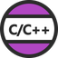
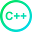
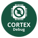

# Install Visual Studio Code IDE and extensions

 **Visual Studio Code** is the lightweight IDE from Microsoft.

## Install Visual Studio Code

To install Visual Studio Code,

+ Download [Visual Studio Code](https://code.visualstudio.com/download) :octicons-link-external-16:.

+ Install it.

For more information on Visual Studio Code,

+ Call the menu **Help > Documentation**: or

+ Visit the [Getting Started](https://code.visualstudio.com/docs#vscode) :octicons-link-external-16: page.

## Install the recommended extensions

Visual Studio Code is based on extensions.

To install an extension using the command line:

``` bash dollar
code --install-extension ms-vscode.cpptools
```

To install an extension using the IDE:

+ Call the menu **View > Extensions** or press ++ctrl+shift+x++.

+ Type the name of the extension to search it.

+ Select the extension and click on **Install**.

!!! note
    If emCode is used on Windows Sub-system for Linux, the extensions may need to be installed on both the Windows and the Linux environments. Visual Studio Code provides accurate recommendations.

### Install the extensions for C/C++

| | Extension | Name
--- | --- | ---
 | C/C++ | `ms-vscode.cpptools`
 | IntelliCode | `VisualStudioExptTeam.vscodeintellicode`
 | Better C++ Syntax | `jeff-hykin.better-cpp-syntax`

### Install the extensions to check the code

| | Extension | Name
--- | --- | ---
 | C/C++ Advanced Lint for Visual Studio Code | `jbenden.c-cpp-flylint`
 | Multilingual, Offline and Lightweight Spellchecker | `ban.spellright`
 | Shortcut Menu Bar | `jerrygoyal.shortcut-menu-bar`
 | Icons | `vscode-icons-team.vscode-icons`
 | Workspace Storage Cleanup | `mehyaa.workspace-storage-cleanup`

The **C/C++ Advanced Lint** manages different static analysers as **CLang**, **CppCheck**, **FlawFinder** and **Lizard**.

For download and documentation, please refer to

+ [CLang](https://clang.llvm.org/) :octicons-link-external-16:;

+ [CppCheck](http://cppcheck.sourceforge.net/) :octicons-link-external-16:;

+ [FlawFinder](https://dwheeler.com/flawfinder/) :octicons-link-external-16:;

+ [Lizard](https://github.com/terryyin/lizard) :octicons-link-external-16:.

Visual Studio Code generates temporary files for each project. The **Workspace Storage Cleanup** extension manages them to save space.

### Install the extensions to format the code

The **C/C++ extension** includes a formatter. As an option, **Artistic Style** provides more parameters.

| | Extension | Name
--- | --- | ---
 | Artistic Style Format | `chiehyu.vscode-astyle`

**Artistic Style** is a utility to indent, format and improve the presentation of the code.

The **Artistic Style extension** requires the prior installation of Artistic Style.

For download and documentation,

+ Please refer to [Artistic Style](https://astyle.sourceforge.net/) :octicons-link-external-16:.

Artistic Style reads the `~/.astylerc` file for the parameters to use.

For more information about the format options,

+ Please refer to the [Documentation](http://astyle.sourceforge.net/astyle.html) :octicons-link-external-16: page on the Artistic Style website.

### Install the extensions to generate documentation

| | Extension | Name
--- | --- | ---
 | Doxygen Documentation Generator | `cschlosser.doxdocgen`

The **Doxygen extension** provides tools to generate the documentation. It requires the prior installation of Doxygen and optionally, GraphViz to generate graphs and LaTex to generate PDFs.

<center>  </center>

**Doxygen** generates all the help files based on comments added to the code. Output formats are HTML and LaTeX. Doxygen includes **DoxyWizard**, a GUI for an easy tweaking of the parameters. Doxygen requires **Graphviz** to draw elaborate dependency trees.

Finally, **TeXShop** translates the generated Doxygen **LaTeX** files into a PDF document.

For download and documentation, please refer to

+ [Doxygen](https://www.doxygen.nl/) :octicons-link-external-16:;
+ [GraphViz](https://graphviz.org/) :octicons-link-external-16:;
+ [LaTeX](https://www.latex-project.org/) :octicons-link-external-16:;
+ [TeXShop](https://pages.uoregon.edu/koch/texshop/) :octicons-link-external-16:.

### Install the extensions to debug

| | Extension | Name
--- | --- | ---
 | Cortex Debug | `marus25.cortex-debug`
 | Debug Tracker | `mcu-debug.debug-tracker-vscode`
 | RTOS View | `mcu-debug.rtos-views`
 | Memory View | `mcu-debug.memory-view`
 | Peripheral Viewer | `mcu-debug.peripheral-viewer`

The **Cortex Debug extension** works with **Segger J-Link**, **OpenOCD**, **STM32CubeProgrammer ST-Link** and **Texane ST-Util** as GDB servers. The MCU-Debug extensions add services to the Cortex Debug extension.

The **Cortex Debug extension** requires the prior installation of J-Link, OpenOCD, ST-Link and Texane ST-Util.

For download and documentation, please refer to

+ [Segger J-Link](https://www.segger.com/products/debug-probes/j-link/tools/j-link-gdb-server/about-j-link-gdb-server/) :octicons-link-external-16:;

+ [OpenOCD](https://openocd.org/) :octicons-link-external-16:;

+ [STMicroelectronic ST-Link](https://www.st.com/en/development-tools/stm32cubeprog.html) :octicons-link-external-16:, part of STM32CubeProgrammer;

+ [Texane ST-Util](https://github.com/stlink-org/stlink) :octicons-link-external-16:.

The Segger J-Link probe may need

``` bash dollar
nano 99-segger-vcom.rules
```

``` bash
ACTION!="add", SUBSYSTEM!="usb_device", GOTO="segger_rules_end"
ATTRS{idVendor}=="1366" ENV{ID_MM_DEVICE_IGNORE}="1"
#ATTRS{idVendor}=="1366" ATTRS{idProduct}=="0105", ENV{ID_MM_DEVICE_IGNORE}="1"
LABEL="segger_rules_end"
```

Save and close with ++ctrl+o++ ++ctrl+x++

``` bash dollar
sudo su
```

``` bash hash
chown root 99-segger-vcom.rules
chmod u=rw 99-segger-vcom.rules
chmod a+r 99-segger-vcom.rules
ls -l 99-segger-vcom.rules
cp 99-segger-vcom.rules /etc/udev/rules.d/99-segger-vcom.rules
udevadm control --reload-rules
exit
```

And, if **JLinkGDBServer** complains about missing libraries, 

``` bash dollar
sudo apt install libncursesw5
```

The **Cortex Debug extension** requires a modern GDB client, version `9` or later. Some boards packages include older versions of the GDB client.

``` bash dollar
sudo apt update
sudo apt install gdb-multiarch
```

For more information on the Cortex Debug extension,

+ Please refer to the [Cortex-Debug](https://github.com/Marus/cortex-debug/wiki) :octicons-link-external-16: wiki.

### Install the extensions for Windows Sub-system for Linux

The **Windows Sub-system for Linux** runs a Linux distribution in Windows. This option is faster and more stable than other options like MinGW, Cygwin or MSYS2.

| | Extension | Name
--- | --- | ---
 | Visual Studio Code Remote – SSH | `ms-vscode-remote.remote-ssh`
 | Visual Studio Code Remote – WSL | `ms-vscode-remote.remote-wsl`

For more information, please refer to

+ [Windows Subsystem for Linux Documentation](https://learn.microsoft.com/en-us/windows/wsl/about) :octicons-link-external-16:;
+ [Install Linux on Windows with WSL](https://learn.microsoft.com/en-us/windows/wsl/install) :octicons-link-external-16:;
+ [Visual Studio Code WSL](https://marketplace.visualstudio.com/items?itemName=ms-vscode-remote.remote-wsl) :octicons-link-external-16: extension;
+ [Developing in WSL](https://code.visualstudio.com/docs/remote/wsl) :octicons-link-external-16: with Visual Studio Code.

## Update Visual Studio Code

### Update IDE

Visual Studio Code checks itself for updates. Alternatively,

+ Call the menu **Help > Check for updates...**.

### Update extensions

Visual Studio Code checks itself for updates. Alternatively,

+ Call the prompt ++ctrl+shift+p++ and then enter **Extensions: Check for Extension Updates**.
