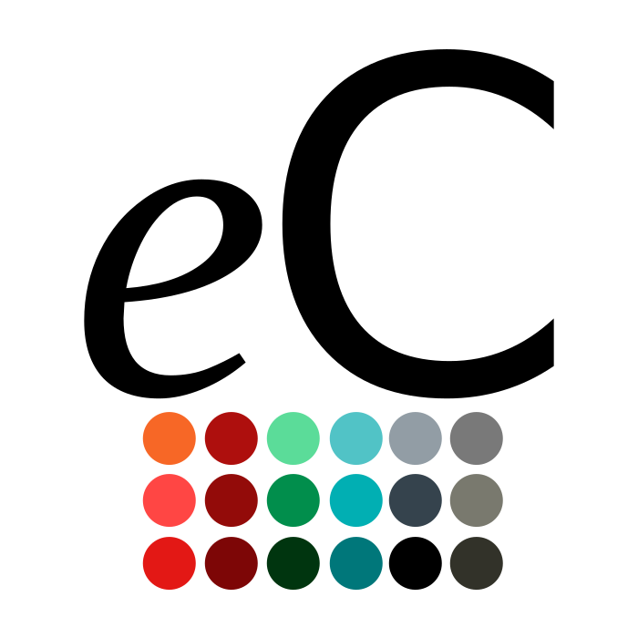

<p>

<div style="font-size: 200%; font-family:'Roboto','Helvetica Neue',Helvetica,Arial,sans-serif">
<!-- <strong>emCode User Manual</strong>-->
</div> 
</p>
# emCode User Manual

## Table of contents

<!-- [Forewords](./Forewords/index.md) -->

* [Install emCode](./Install/index.md)

* [Develop a project](./Develop/index.md)

* [Manage the boards](./Boards/index.md)

* [Solve issues](./Issues/index.md)

* [Appendixes](./Appendixes/index.md)

<!--
----

<form action="https://www.paypal.com/cgi-bin/webscr" method="post" target="_top"><input type="hidden" name="cmd" value="_s-xclick"><input type="hidden" name="hosted_button_id" value="CJYVP4YBS2RSW"><input type="image" src="https://www.paypalobjects.com/en_US/i/btn/btn_donateCC_LG.gif" border="0" name="submit" alt="PayPal - The safer, easier way to pay online!"></form>
-->

<!-- # Forewords -->

----

## What is emCode?

<!-- <center></center> -->

emCode is a set of tools to ease development for the most popular embedded computing boards supported by the Arduino SDK. Those tools are designed to be used with the excellent Visual Studio Code IDE.

For convenience, emCode relies on the Arduino SDK, as it packs and manages the tool-chains, frameworks and utilities for a large range of boards.

<center></center>

emCode is the continuation of [embedXcode](https://embeddedcomputing.weebly.com/embedxcode.html) :octicons-link-external-16:, which pioneered the use of a professional IDE with all the modern amenities. 

Compared with embedXcode, emCode has two notable differences: emCode is no longer designed for Xcode but for Visual Studio Code; emCode no longer targets macOS but Linux and Windows with Windows Sub-system for Linux (WSL).

<center>   </center>

Today, the offer of advanced IDEs for the Arduino SDK is large. Let's mention

+ [Arduino 2.0 IDE](https://www.arduino.cc/en/software) :octicons-link-external-16: based on Eclipse Theia;
+ [PlatformIO](https://embeddedcomputing.weebly.com/platformio.html) :octicons-link-external-16: for Visual Studio Code;
+ [Visual Micro](https://embeddedcomputing.weebly.com/visual-micro-on-windows.html) :octicons-link-external-16: for Visual Studio on Windows only; and
+ [Visual Studio Code](https://embeddedcomputing.weebly.com/visual-studio-code.html) :octicons-link-external-16: and the [Arduino extension](https://embeddedcomputing.weebly.com/arduino-extension-for-visual-studio-code.html) :octicons-link-external-16:.

Happy development!

*&mdash; Rei Vilo*

## Links

Please find the main links for emCode.

|  | **emCode** | | | |
| :----: | :----: | :----: | :----: | :----: |
| <br>[Website](https://emCode.weebly.com) :octicons-link-external-16: | <br>[Download](https://github.com/rei-vilo/emCode/) :octicons-link-external-16: | <br>[User manual](https://rei-vilo.github.io/emCode/) :octicons-link-external-16: | <br>[RSS feed](https://emCode.weebly.com/1/feed) :octicons-link-external-16: | <br>[LinkedIn](https://www.linkedin.com/in/rei-vilo-02490555) :octicons-link-external-16: |

## Conventions

This website uses the following typographic conventions:

+ Keywords and folders names are in `Terminal` font:

> Download and install Arduino 2.0 under the `/Applications` folder.

+ Code is displayed with `Terminal` font in a light grey box:

``` cpp
#include "Arduino.h"
```

+ Notes and warnings are displayed inside coloured boxes.

!!! danger

!!! warning

!!! info

!!! note

!!! example

+ Applications are in **Sans Serif bold** font.

> Open a **Terminal** window.

+ Elements of the interface and menus are presented using **Sans Serif bold** font. Keyboard shortcuts and mouse actions are framed.

> Call the menu **File > New > New Project...** or press ++shift+cmd+n++.

+ A :octicons-link-external-16: mentions an external link to the web.

> The local libraries should comply with the [Arduino IDE 1.5: Library specification](https://arduino.github.io/arduino-cli/0.33/library-specification/).:octicons-link-external-16:.

+ Dates are stated as `DD MMM YYYY`, with `DD` for day, `MMM` for month in plain letters, and `YYYY` for year.

> 10 Dec 2018 | 10.3.4 | Updated support for Arduino 1.8.8 IDE

+ The :octicons-download-16: on top of the current page downloads it as a PDF document.

The downloaded documents are subject to change without prior notice.
